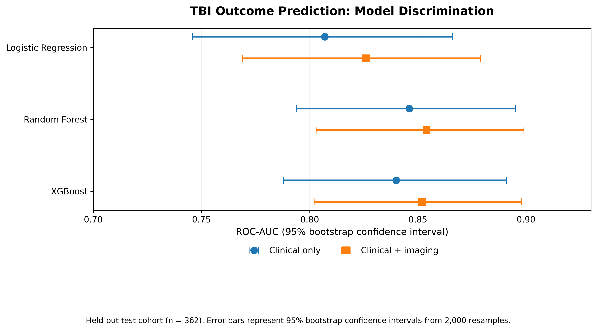

### Neurosurgery & Artificial Intelligence Portfolio

I am a clinician currently working in neurosurgery with interests in neuroscience, medical technology, machine learning, and computational modelling.

This portfolio documents projects investigating how computational methods can be applied to clinical prediction, medical imaging, cerebrovascular haemodynamics, and spinal biomechanics.

The emphasis is not only on predictive performance or simulation results, but also on clinical question formulation, methodological validity, numerical verification, interpretability, and the limitations involved in translating computational research into clinical practice.

---

## Projects

| Project | Clinical question | Methods | Status |
|---|---|---|---|
| **Traumatic Brain Injury Outcome Prediction** | Can early clinical and imaging information predict 90-day functional outcome after TBI? | Logistic regression, Random Forest, XGBoost, SHAP | **Completed** |
| **Glioma MRI Segmentation** | Can deep learning segment tumour-related regions on postoperative multimodal glioma MRI? | Multimodal MRI preprocessing, 3D U-Net, Dice-based evaluation, statistical analysis | **Completed** |
| **Intracranial Aneurysm CFD** | How does aneurysm geometry influence local blood-flow patterns and wall shear stress? | OpenFOAM, Gmsh, ParaView, finite-volume simulation | **Exploratory — preliminary results; paused** |
| **Lumbar Spine Finite Element Analysis** | How do vertebra–disc interface constraints influence predicted spinal stiffness under axial compression? | CalculiX, Python, tetrahedral FEA, interface sensitivity analysis | **Exploratory — baseline simulations completed; validation ongoing** |
| **EEG Seizure Detection** | Can seizure activity be detected from EEG recordings using signal processing and machine learning? | Signal processing, machine learning, deep learning | **Future project** |
| **Intracranial Pressure Crisis Forecasting** | Can physiological time-series data provide early warning of intracranial hypertension? | Time-series analysis, machine learning, deep learning | **Future project** |

---

## Project 1 — Traumatic Brain Injury Outcome Prediction

**Status: Completed**

A prognostic machine-learning study using the multinational GNS-I traumatic brain injury cohort.

The project examines whether information available during early assessment can predict unfavourable functional outcome at 90 days, and whether structured imaging findings provide additional prognostic information beyond clinical assessment alone.

**Data source:** Global Neurosurgical Study-1 (GNS-I)  
[Original Nature Medicine study →](https://doi.org/10.1038/s41591-026-04600-6)

### Key findings

- Early clinical information provided useful discrimination for 90-day functional outcome.
- Random Forest and XGBoost demonstrated higher discrimination than the logistic-regression baseline.
- The clinical + imaging Random Forest achieved a held-out ROC-AUC of **0.854**, average precision of **0.706**, and Brier score of **0.114**.
- Adding imaging information produced relatively modest improvements in discrimination.
- Glasgow Coma Scale, pupil reactivity and age were the most influential predictors in the interpreted Random Forest model.

### Model Performance

*Comparison of held-out ROC-AUC across three model families using clinical-only and clinical-plus-imaging predictors. Adding imaging provided relatively modest improvements in discrimination.*

### Project Resources

**[View the TBI project showcase →](projects/tbi-outcome-prediction.md)**

*The underlying research repository is maintained privately while the work is under consideration for academic dissemination.*

---

## Project 2 — Glioma MRI Segmentation

**Status: Completed**

A deep-learning study investigating automated segmentation of postoperative glioma MRI using a multilabel three-dimensional U-Net.

Using the BraTS 2024 GLI dataset, the project investigates multimodal MRI preprocessing, segmentation of postoperative tumour-related regions, model development, and evaluation on a held-out test cohort with subject-level separation. Particular attention was given to resection-cavity segmentation, which presents challenges in postoperative neuro-oncological imaging.

### Key findings

- The selected model was evaluated on **198 held-out MRI examinations from 92 subjects**, with subject-level separation from the development cohorts.
- Baseline macro-average Dice across four segmentation regions was **0.6525**, increasing to **0.6630** following validation-informed resection-cavity post-processing.
- Among **157 examinations containing a reference resection cavity**, mean resection-cavity Dice improved from **0.5221 to 0.5638**.
- The mean paired improvement was **+0.0417** (95% subject-clustered bootstrap confidence interval: **+0.0227 to +0.0625**).
- Anatomical failure-case analysis identified important limitations, including deterioration in individual cases despite improved average performance.

The study illustrates the importance of evaluating medical-imaging models beyond aggregate accuracy, particularly when considering their potential clinical relevance.

### Clinical Failure Analysis — Anatomical Interpretation

*Representative held-out test case examined during anatomical failure analysis. The model's resection-cavity Dice score deteriorated markedly following post-processing (0.5345 to 0.0046). Review of the MRI and reference segmentation raised the possibility of annotation ambiguity, although an annotation error has not been independently confirmed.*

This case illustrates an important limitation of automated medical-image segmentation: quantitative performance metrics must be interpreted alongside the underlying anatomy and the quality of reference annotations.

### Project Resources

**[Read the Glioma MRI Segmentation project overview →](projects/glioma-mri-segmentation.md)**

[Read the full scientific report →](https://github.com/T-Y-Ang/glioma-mri-segmentation/blob/main/reports/glioma_segmentation_report.md)

[Explore the public GitHub repository →](https://github.com/T-Y-Ang/glioma-mri-segmentation)

---

## Project 3 — Intracranial Aneurysm Haemodynamics (CFD)

**Status: Exploratory Study — Preliminary Results; Temporarily Paused**

A computational fluid dynamics study investigating blood-flow behaviour within intracranial aneurysms using synthetic and patient-derived vascular geometries.

The project progressed from synthetic sidewall aneurysm modelling to a patient-derived left middle cerebral artery aneurysm from the publicly available Royal Brisbane TOF-MRA Intracranial Aneurysm dataset (OpenNeuro ds005096).

### Key achievements

- Developed a computational workflow involving vascular geometry processing, tetrahedral meshing, OpenFOAM simulation and ParaView visualisation.
- Generated a patient-derived baseline mesh containing **117,490 tetrahedral elements**.
- Completed a preliminary steady-state laminar-flow simulation and verified global mass conservation.
- Visualised velocity streamlines, vorticity and preliminary wall shear stress.
- Generated a refined mesh containing **221,743 tetrahedral elements** for subsequent numerical comparison.
- Identified unresolved outlet-geometry and mesh-quality issues requiring correction before further physiological interpretation.

### Patient-Derived Aneurysm — Preliminary Flow Visualisation

*Preliminary velocity streamlines from the patient-derived left MCA aneurysm simulation. Results have not undergone mesh-independence testing, and an unresolved outlet-geometry concern may influence the computed flow distribution.*

### Current limitations

Although the baseline simulation was completed and global mass conservation was demonstrated, **mesh independence and physiological validity have not been established**.

The computational model uses simplified steady-state boundary conditions and rigid vessel walls. Both baseline and refined meshes retain quality warnings, and a possible residual surface-cap fragment may restrict one vessel outlet.

The refined-mesh flow simulation and formal sensitivity analyses remain outstanding.

**These results are exploratory and cannot be used to predict aneurysm rupture risk or guide clinical management.**

### Project resources

**[Read the Aneurysm CFD project report →](projects/aneurysm-cfd.md)**

[Read the full interim technical report →](https://github.com/T-Y-Ang/aneurysm-cfd/blob/main/docs/patient_mca_cfd_interim_report.md)

[Explore the public GitHub repository →](https://github.com/T-Y-Ang/aneurysm-cfd)

---

## Project 4 — Lumbar Spine Finite Element Analysis

**Status: Exploratory Study — Baseline Simulations Completed; Mechanical Validation Ongoing**

A computational biomechanics study investigating the mechanical behaviour of the lumbar spine under simplified axial compression, with particular emphasis on vertebra–disc interface modelling.

The project uses an existing L1–L2 finite element mesh obtained from a publicly available Zenodo dataset. The anatomical model contains two vertebral bodies and an intervening intervertebral disc.

### Key achievements

- Converted an existing MED-format anatomical mesh into a CalculiX-compatible finite element model containing **17,513 nodes and 62,247 tetrahedral elements**.
- Completed two axial compression simulations using simplified linear-elastic material properties and a prescribed **0.1 mm displacement**.
- Verified approximate global axial force equilibrium in both simulations.
- Investigated the effect of vertebra–disc tie tolerance on mechanical response.
- Identified a **40.07% increase in calculated axial stiffness** when the tie tolerance was increased to 0.05 mm.
- Investigated the geometry and topology of the vertebra–disc interfaces to understand residual tie-constraint failures.

### Vertebra–Disc Interface Investigation

*Distribution of rejected tie nodes at the L1–disc and disc–L2 interfaces following adjustment of the tie tolerance to 0.05 mm. Residual failures were concentrated at the peripheral disc interfaces.*

### Current limitations

Although both simulations completed successfully and demonstrated approximate global axial force equilibrium, **biomechanical validity and mesh convergence have not been established**.

The model uses simplified material properties, first-order tetrahedral elements and idealised loading conditions. Its predicted mechanical stiffness and stresses remain sensitive to interface constraint assumptions.

The remaining peripheral tie failures require further investigation before interpreting the model as a reliable representation of physiological spinal loading.

**These results demonstrate computational feasibility and interface sensitivity, not clinically validated spinal biomechanics.**

### Project resources

**[Read the Spinal FEA project report →](projects/spinal-fea.md)**

[Read the interface methodology report →](https://github.com/T-Y-Ang/spinal-fea/blob/main/docs/interface_methodology.md)

[Explore the public GitHub repository →](https://github.com/T-Y-Ang/spinal-fea)

---

## Portfolio Approach

These projects are developed around clinically relevant questions rather than algorithm or software selection alone.

Across machine-learning projects, I aim to consider:

- appropriate clinical question formulation;
- data quality, missing information and information leakage;
- comparison with interpretable baseline models;
- discrimination, calibration and model interpretability;
- rigorous validation and generalisability.

For computational simulation projects, additional considerations include:

- anatomical geometry and modelling assumptions;
- material properties and boundary conditions;
- mesh quality and numerical convergence;
- reproducibility and sensitivity analysis;
- the distinction between simulated physical behaviour and clinically validated predictions.

The projects are intended as educational and research work and should not be interpreted as clinically validated decision-support tools.

---

## Current Development

The traumatic brain injury outcome prediction and glioma MRI segmentation studies are completed. Exploratory computational demonstrations have also been established for intracranial aneurysm haemodynamics and lumbar spinal biomechanics.

**Current development is focused on validating and extending the spinal finite element analysis workflow.**

The spinal FEA project has progressed from anatomical mesh preparation to successful baseline compression simulations. Subsequent investigations identified substantial sensitivity of predicted axial stiffness to vertebra–disc interface constraints, highlighting the importance of numerical verification before biomechanical interpretation.

The next priorities are displacement and stress-field visualisation, investigation of interface-related numerical artefacts, and further assessment of mesh and mechanical reliability.

Longer-term objectives include reconstructing pathological vertebral anatomy from publicly available CT datasets and investigating vertebral compression fractures, progressive deformity and potentially the biomechanical consequences of surgical interventions.

The intracranial aneurysm CFD project is temporarily paused after completing its patient-derived baseline simulation and preliminary haemodynamic visualisations. Further work will be required to resolve outlet-geometry uncertainty, improve mesh quality and establish numerical reliability.

Future projects may return to EEG seizure detection, intracranial pressure forecasting and other applications of computational methods to neurosurgical research.

Across these projects, the emphasis remains on reproducible computational workflows, transparent reporting of limitations and the distinction between successful numerical simulations and clinically validated models.
