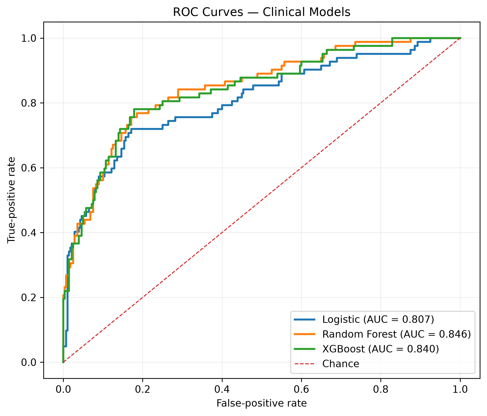
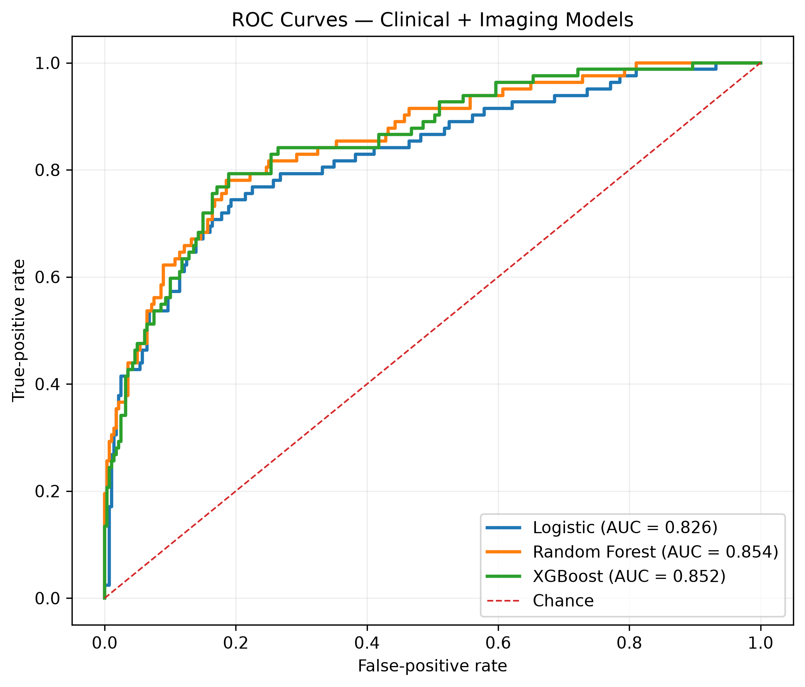
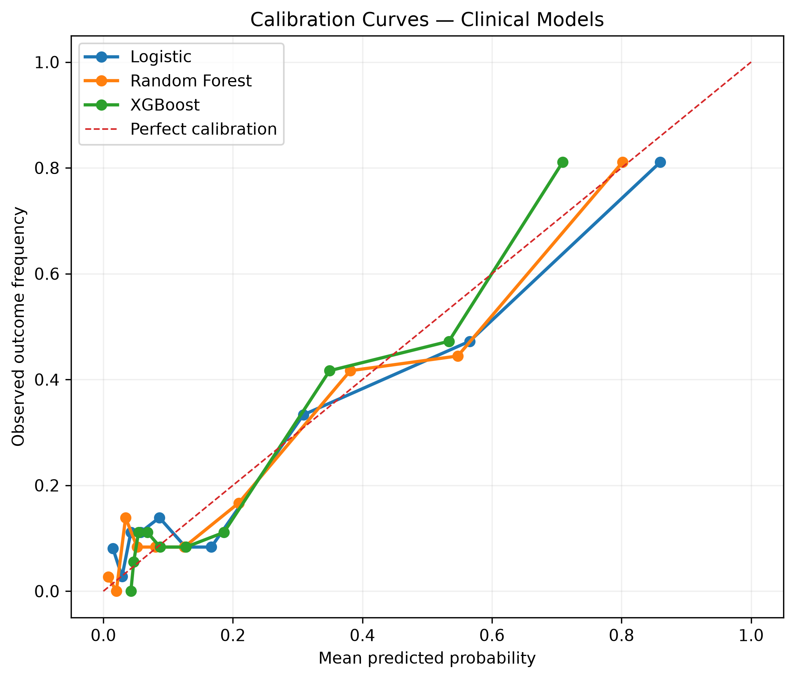
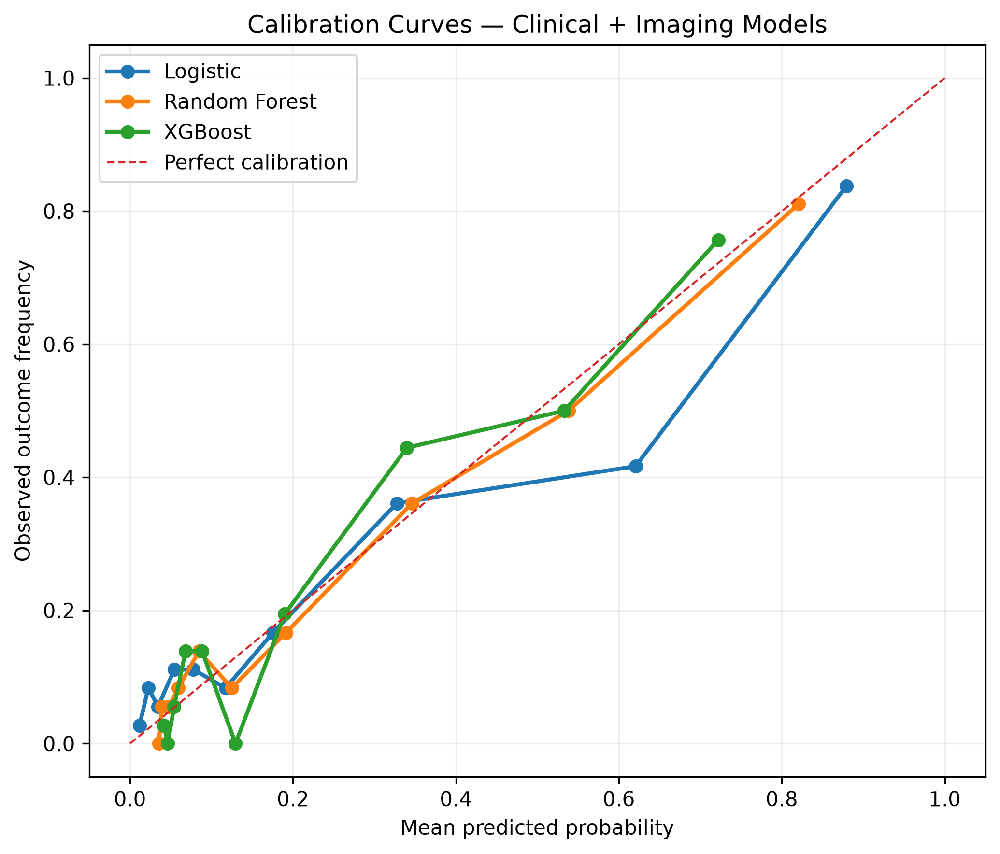
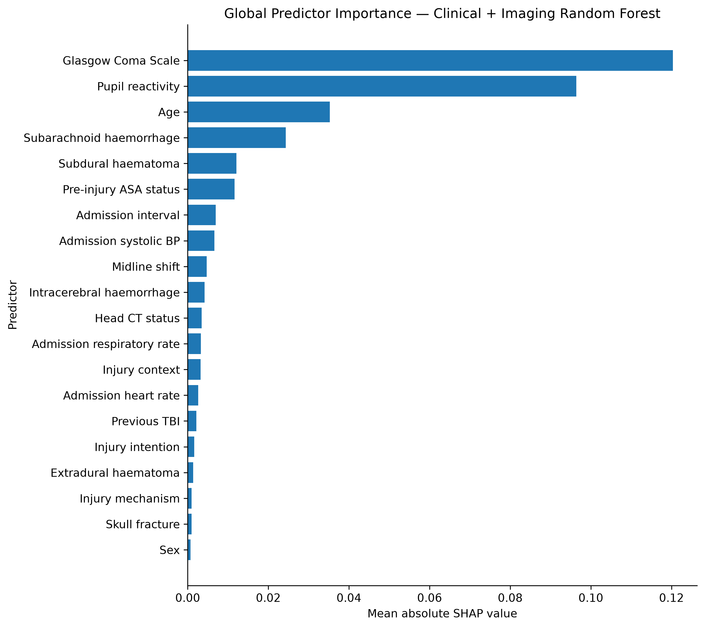
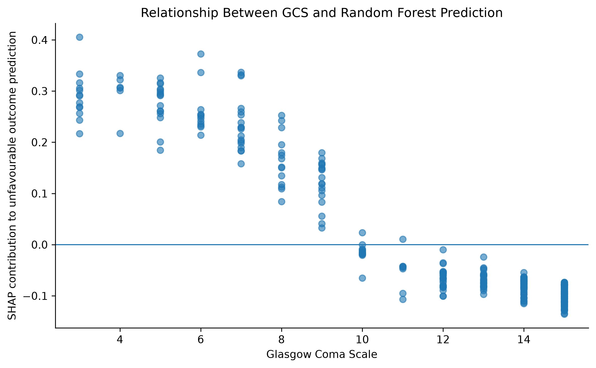
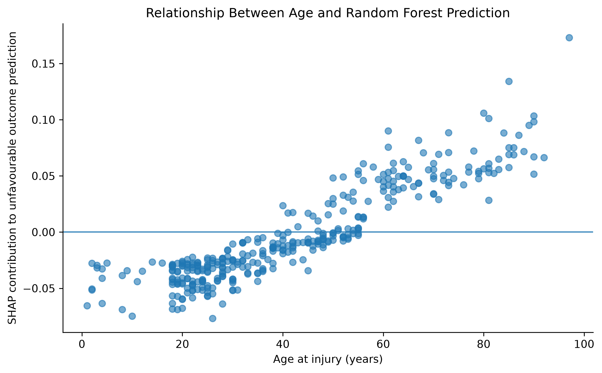

# Predicting 90-Day Functional Outcome After Traumatic Brain Injury

**Machine-learning analysis of early clinical and imaging information in the
multinational GNS-I cohort**

[← Back to portfolio](../README.md)

---

## Clinical question

Can information available during the early assessment of patients with
traumatic brain injury predict an unfavourable functional outcome at 90 days?

A secondary question was:

> **How much additional prognostic information does early imaging provide beyond
> clinical assessment alone?**

The outcome was defined using the Glasgow Outcome Scale (GOS):

- **Unfavourable outcome:** GOS 1–3
- **Favourable outcome:** GOS 4–5

---

### Data source & original study

This project is a secondary prognostic modelling analysis of data from the
**Global Neurosurgical Study-1 (GNS-I)**, a prospective multinational cohort
of patients with traumatic brain injury recruited across 100 hospitals in
29 countries.

The original GNS-I study investigated variation in traumatic brain injury
characteristics and outcomes across Human Development Index strata. The present
project asks a separate question: whether information available during early
clinical assessment can be used to predict 90-day functional outcome.

**Original study:**  
Nugent JG, Tan H, Stedelin B, et al. *Traumatic brain injury outcomes across
human development index strata in 29 countries.* Nature Medicine. 2026.  
[View the original publication →](https://doi.org/10.1038/s41591-026-04600-6)

**GNS-I data and original analysis repository:**  
[View the GNS-I repository →](https://github.com/jgnugent/GNS-I-Analysis)

---

## Why this question matters

Early prognostication after traumatic brain injury is difficult. Clinicians
integrate neurological examination, physiological state, patient factors and
neuroimaging when estimating injury severity and likely outcome.

Machine learning provides a way to examine how much prognostic information is
contained within these early data and whether more complex models or additional
imaging variables materially improve prediction.

The objective of this project was therefore not simply to maximise predictive
performance, but to examine the **incremental value of model complexity and
imaging information**.

---

## Dataset

The project used data from the **Global Neurosurgical Study-1 (GNS-I)**, a
prospective international multicentre study of traumatic brain injury across
100 hospitals in 29 countries.

| Cohort | Patients |
|---|---:|
| Source cohort | 2,165 |
| 90-day outcome available | 1,810 |
| 90-day outcome unavailable | 355 (16.4%) |
| Unfavourable outcome | 410 |
| Favourable outcome | 1,400 |
| Unfavourable outcome prevalence | 22.7% |

Only patients with an observed 90-day outcome were included in supervised model
development. Missing predictor values were handled within the modelling
pipelines rather than excluding otherwise eligible patients.

---

## Study design

Two predictor sets were compared.

### Clinical model

Thirteen variables available during early assessment were included, covering:

- age and sex;
- pre-injury health status;
- injury characteristics;
- Glasgow Coma Scale;
- pupil reactivity;
- admission blood pressure;
- heart rate; and
- respiratory rate.

### Clinical + imaging model

Seven structured imaging variables were added:

- head CT status;
- extradural haematoma;
- subdural haematoma;
- subarachnoid haemorrhage;
- intracerebral haemorrhage;
- midline shift; and
- skull fracture.

Three modelling approaches were evaluated:

1. **Logistic regression**
2. **Random Forest**
3. **XGBoost**

The modelling cohort was divided into an 80% training cohort and a 20%
stratified held-out test cohort.

Model selection and hyperparameter optimisation were performed using the
training data. The held-out cohort was reserved for final evaluation.

---

## Model evaluation

Performance was assessed using complementary measures:

- **ROC-AUC** — discrimination between favourable and unfavourable outcomes;
- **Average precision** — precision-recall performance;
- **Brier score** — accuracy of predicted probabilities; and
- **Calibration intercept and slope** — agreement between predicted and
  observed risk.

Uncertainty was assessed using 2,000 bootstrap resamples of the held-out test
cohort.

---

# Results

## Held-out predictive performance

| Model | Predictors | ROC-AUC | Average Precision | Brier score |
|---|---|---:|---:|---:|
| Logistic regression | Clinical | 0.807 | 0.637 | 0.125 |
| Logistic regression | Clinical + imaging | 0.826 | 0.644 | 0.124 |
| Random Forest | Clinical | 0.846 | 0.691 | 0.116 |
| **Random Forest** | **Clinical + imaging** | **0.854** | **0.706** | **0.114** |
| XGBoost | Clinical | 0.840 | 0.685 | 0.118 |
| XGBoost | Clinical + imaging | 0.852 | 0.688 | 0.117 |

All three modelling approaches demonstrated useful discrimination.

Random Forest and XGBoost showed higher discrimination than logistic
regression. However, XGBoost did not demonstrate a clear advantage over Random
Forest despite its additional modelling complexity.

### Discrimination

<table>
  <tr>
    <td width="50%">
      
    </td>
    <td width="50%">
      
    </td>
  </tr>
  <tr>
    <td align="center"><b>Clinical predictors</b></td>
    <td align="center"><b>Clinical + imaging predictors</b></td>
  </tr>
</table>

The tree-based models demonstrated higher discrimination than logistic
regression, while the difference between Random Forest and XGBoost was small.

---

## How much did imaging add?

| Model | Change in ROC-AUC after adding imaging | 95% CI |
|---|---:|---:|
| Logistic regression | +0.019 | +0.002 to +0.037 |
| Random Forest | +0.007 | −0.010 to +0.024 |
| XGBoost | +0.011 | +0.002 to +0.022 |

Imaging produced **modest incremental improvements in discrimination**.

Changes in Brier score were small and their confidence intervals included zero
for all three model families.

This suggests that much of the prognostic information available to these
models was already contained within the early clinical assessment.

---

## Did more complex machine learning perform better?

Compared with logistic regression, Random Forest improved ROC-AUC by:

- **+0.039** using clinical predictors; and
- **+0.027** using clinical + imaging predictors.

XGBoost also improved discrimination compared with logistic regression, but it
did not clearly outperform Random Forest.

This illustrates an important finding from the project:

> **Increasing algorithmic complexity did not necessarily produce a meaningful
> improvement in predictive performance.**

---

## Calibration

The clinical + imaging Random Forest produced:

- **Calibration intercept:** −0.056
- **Calibration slope:** 0.972
- **Brier score:** 0.114

These point estimates were descriptively close to ideal calibration
(intercept 0, slope 1), although they were obtained from a single held-out
cohort and should not be interpreted as evidence of external calibration.

<table>
  <tr>
    <td width="50%">
      
    </td>
    <td width="50%">
      
    </td>
  </tr>
  <tr>
    <td align="center"><b>Clinical predictors</b></td>
    <td align="center"><b>Clinical + imaging predictors</b></td>
  </tr>
</table>

The dashed diagonal represents perfect calibration. These curves complement the
numerical calibration estimates by showing agreement between predicted
probabilities and observed outcome frequencies across the range of predicted
risk.

---

# What information did the model use?

SHAP analysis was performed on the clinical + imaging Random Forest to examine
model behaviour.

### Global predictor importance

The most influential predictors were:

1. **Glasgow Coma Scale**
2. **Pupil reactivity**
3. **Age**
4. Subarachnoid haemorrhage
5. Subdural haematoma
6. Pre-injury ASA status

GCS and pupil reactivity contributed substantially more to model predictions
than any individual imaging variable.

Lower GCS, bilateral pupil non-reactivity and increasing age generally shifted
model predictions toward unfavourable outcome.

### Direction of predictor contributions

<table>
  <tr>
    <td width="50%">
      
    </td>
    <td width="50%">
      
    </td>
  </tr>
  <tr>
    <td align="center"><b>Glasgow Coma Scale</b></td>
    <td align="center"><b>Age at injury</b></td>
  </tr>
</table>

Lower GCS values generally shifted predictions toward unfavourable outcome,
whereas higher GCS values shifted predictions away from unfavourable outcome.
Increasing age generally shifted predictions toward unfavourable outcome.

The apparent relationships should not be interpreted as validated clinical
thresholds or causal effects.

These relationships were clinically coherent, but SHAP values describe the
behaviour of the fitted model and **must not be interpreted as causal effects**.

---

# Missing follow-up and robustness

A 90-day outcome was unavailable for **355 patients (16.4%)**.

Follow-up completeness varied substantially between countries, and patients
without recorded 90-day outcomes had greater missingness in several baseline
clinical variables.

The complete-outcome modelling cohort may therefore differ systematically from
the original study population.

No missing 90-day outcomes were imputed.

This represents an important potential source of selection bias, and the
direction or magnitude of that bias cannot be determined from this analysis.

---

# Clinical interpretation

Several findings were particularly informative.

First, **early bedside clinical assessment contained substantial prognostic
information**. GCS, pupil reactivity and age dominated the interpreted model.

Second, adding structured CT findings improved discrimination only modestly.
This does not imply that imaging is clinically unimportant. Rather, it suggests
that the selected imaging variables added relatively limited predictive
information beyond the clinical variables already available to these models.

Third, increasing model complexity showed diminishing returns. Random Forest
improved discrimination compared with the logistic-regression baseline, while
XGBoost did not clearly improve upon Random Forest.

Together, these findings reinforce the distinction between building a more
complex model and building a meaningfully better clinical prediction model.

---

# Limitations

Important limitations include:

- internal rather than external validation;
- random patient-level splitting does not test geographic transportability;
- incomplete 90-day follow-up;
- potential selection bias;
- missing predictor data and data-quality limitations;
- variation in imaging availability and documentation;
- loss of information from dichotomising the five-level GOS;
- bootstrap intervals conditional on already-fitted models; and
- SHAP values representing model behaviour rather than causal relationships.

The models should therefore be considered **internally validated and
hypothesis-generating**, not suitable for clinical deployment.

---

# What I learned from this project

This project was valuable not only as an exercise in model development, but in
understanding the methodological requirements of clinical prediction research.

Several lessons were particularly important:

**Model discrimination is only part of model evaluation.**  
A clinically useful probability model must also produce appropriately
calibrated risk estimates.

**More complex models are not automatically better models.**  
XGBoost required substantially greater optimisation but did not clearly
outperform Random Forest in the held-out cohort.

**Additional clinical information should be evaluated incrementally.**  
Rather than assuming imaging would improve prediction, comparing matched
clinical and clinical + imaging models allowed its additional prognostic value
to be quantified directly.

**Missing outcomes matter differently from missing predictors.**  
Predictor missingness can often be incorporated into a modelling strategy,
whereas missing outcome data can change which patients enter the modelling
cohort and introduce selection bias.

**Internal validation does not establish clinical generalisability.**  
A model performing well in a random held-out subset of a multinational dataset
has not necessarily demonstrated transportability across countries, healthcare
systems or future patient populations.

These considerations changed the project from an exercise in fitting
machine-learning algorithms into an investigation of how prediction models
should be evaluated in a clinical research setting.

---

# Conclusion

Early clinical information predicted 90-day functional outcome after traumatic
brain injury with useful discrimination in this multinational cohort.

Tree-based models improved discrimination relative to the logistic-regression
baseline, but greater algorithmic complexity did not necessarily provide
additional benefit.

Structured imaging variables provided modest incremental prognostic
information, while GCS, pupil reactivity and age remained the dominant
contributors to model predictions.

External and geographically structured validation would be required before
considering clinical application.

---

## Project status

**Completed — portfolio version 1.0**

The underlying analytical repository, source code and patient-level modelling
workflow are being maintained separately while the work is considered for
potential further research development.

[← Return to the main portfolio](../README.md)
